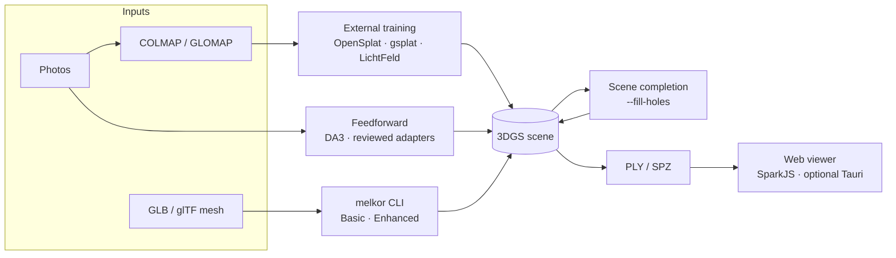

<div align="center">

<picture>
  <source media="(prefers-color-scheme: dark)" srcset="assets/logo-dark.svg">
  
</picture>

# Melkor

**A 3D Gaussian Splatting toolkit for conversion, inspection, scene completion, reconstruction pipelines, and viewing.**

[](https://github.com/sepahead/melkor/actions/workflows/ci.yml)
[](https://github.com/sepahead/melkor/tree/v2.0.0-rc.1)
[](LICENSE)


[Overview](#overview) ·
[Requirements](#requirements) ·
[Quick Start](#quick-start) ·
[Usage](#usage) ·
[Viewer](#viewer) ·
[Documentation](#documentation) ·
[Contributing](#contributing)

</div>

> **Development status: v2 hardening in progress. No production binary release is
> currently supported.**
>
> `main` is development software and its public contract is still changing. The `1.x`
> releases remain downloadable but are not the supported production line, and
> `v2.0.0-rc.1` is a source-only candidate — no signed binaries, SDK packages, Python
> wheels, or desktop applications have been published for it.
>
> The first supported production line will be `v2.0.0`. What it must satisfy before it can
> be called that is tracked in [production blockers](docs/audit/production-blockers.md),
> and the product boundary is in [ROADMAP.md](ROADMAP.md). Support status:
> [SUPPORT.md](SUPPORT.md).

## Overview

Melkor combines a deterministic native CLI with reviewed reconstruction
adapters and an offline-capable web viewer. The CLI converts GLB/glTF meshes
and 3DGS assets, validates files without initializing a GPU, and performs
geometry-based scene completion. Photo training and neural reconstruction are
handled by explicit external pipelines rather than being presented as native
CLI features.

### Support at a glance

| Capability | Status | Interface |
|---|---|---|
| Mesh → splats | Maintained native path | `melkor INPUT.glb OUTPUT.ply` (`--basic` or `--enhanced`) |
| 3DGS PLY ↔ SPZ | Maintained native path | Reads SPZ v1–v3; writes SPZ v3 |
| Asset validation | Maintained native path | `melkor inspect INPUT [--json] [--strict]` |
| Scene completion | Maintained native path | Deterministic densification with `--fill-holes` |
| Training from photos | External tool integrations | COLMAP/GLOMAP plus OpenSplat, gsplat, or LichtFeld-Studio |
| Feedforward reconstruction | Reviewed bridge/catalog | DA3 bridge; other adapters are license- and platform-dependent |
| Web viewing | Maintained viewer | PLY, SPZ, SPLAT, KSPLAT, and SOG/ZIP; 2 GiB local-file ceiling, with the practical limit set by browser/device memory |
| Desktop viewing | Developer build | Optional Tauri shell; local bundles are unsigned |

### Highlights

- **Honest conversion modes.** Basic is fast vertex-to-splat conversion;
  Enhanced adds k-NN adaptive scale and surface alignment. Both operate on
  mesh geometry. Trained fitting and neural reconstruction use dedicated
  pipelines.
- **Deterministic inspection.** `melkor inspect` reports metadata, counts,
  bounds, field provenance, and numeric hazards without changing the source or
  initializing a GPU. The JSON schema is versioned as `melkor.inspect.v1`.
- **Explicit format behavior.** Melkor currently reads SPZ v1–v3 and writes v3. Upstream
  SPZ has since moved to file-format v4; v4 support is a `v2.0.0` release blocker
  ([P0-09](docs/audit/production-blockers.md)) and is not claimed until it is tested
  against the pinned upstream implementation. SPZ is a quantized, compressed
  representation, so a conversion into it is lossy by construction. Melkor does not
  currently publish a measured compression ratio; any such figure will be stated only
  with the dataset, version, and configuration that produced it.
- **Geometry-based completion.** The advancing-front densifier bridges
  interior occlusion holes and sparse regions without a learned prior, while
  preserving the scene's outer boundary.
- **Backend parity.** Metal, CUDA, and CPU share the same `ComputeProvider`
  contract and host-built uniform grid. Runtime parity uses numeric tolerances
  appropriate for normal floating-point rounding.
- **Focused viewer.** SparkJS + THREE.js provide private local-file opening,
  drag-and-drop, named camera views, deep-linked bundled scenes, progressive
  first-load rendering, orbit/fly controls, and a bounded-memory 4D player.

Training integrations currently cover single-device OpenSplat, true
distributed data-parallel training with gsplat CUDA, gsplat-mps on Apple
Silicon, and LichtFeld-Studio on Linux/CUDA. The feedforward catalog is dated
and license-aware: some systems are evaluation adapters rather than ordinary
image-folder reconstruction tools, and some checkpoints have non-commercial
or unspecified terms. See [Feedforward SOTA](docs/FEEDFORWARD_SOTA.md).

Spark exposes `.RAD`/LOD primitives that Melkor can build on, but `.RAD` local
opening and LOD authoring are not current Melkor features. Likewise,
`setup_streaming.sh` checks out and scaffolds reviewed upstream SLAM/4D tools;
each tool still needs its own Linux/CUDA environment and calibrated dataset.
See [Streaming and 4D](docs/STREAMING.md).

## Requirements

- **Native CLI:** Git, CMake 3.20+, and a C++17 compiler.
- **macOS:** macOS 13+ with Xcode Command Line Tools. Metal is enabled by
  default.
- **Linux:** GCC or Clang for the CPU build. NVIDIA CUDA is optional, disabled
  by default, and requires CUDA Toolkit 11+.
- **Complete test suite:** Python 3.11 and NumPy 2.4.6 reproduce the pinned CI
  environment. Neither is required just to build or run the native CLI.
- **Viewer:** curl fetches digest-checked assets, Node.js generates project
  demos, and Bun runs the local server. Playwright/Chromium are needed only for
  render tests.
- **Reconstruction pipelines:** Python, CUDA, model, and license requirements
  vary by upstream tool. Follow the linked pipeline document before setup.

`scripts/setup_deps.sh` verifies the pinned third-party snapshots already
committed to this repository. It does not install system packages or download
live dependencies.

The Melkor core is MIT-licensed, and as of 2026-07-14 it no longer vendors any copyleft or
research-only source. What it redistributes — SPZ, tinygltf, stb — is permissively licensed
and pinned in `third_party/manifest.lock.json`.

External reconstruction and training systems remain under **their own terms**, which are not
Melkor's terms. OpenSplat is AGPL-3.0-only, and several model checkpoints are research-only,
non-commercial, or publish no clear terms at all. Melkor invokes those programs; it does not
ship them, and it cannot grant you rights to them. Review
[Third-party licences](THIRD_PARTY_LICENSES.md) and [External adapters](docs/adapters/index.md)
before redistribution or model use.

## Quick Start

```bash
git clone https://github.com/sepahead/melkor.git
cd melkor

# Reproduce the lightweight Python environment used by the complete test suite.
# Skip this environment and the CTest step if you only need the native CLI.
python3.11 -m venv .venv
. .venv/bin/activate
python -m pip install --disable-pip-version-check \
  --only-binary=:all: numpy==2.4.6

# Verify vendored sources, configure, build, and test.
./scripts/setup_deps.sh
cmake -S . -B build -DCMAKE_BUILD_TYPE=Release \
  -DPython3_EXECUTABLE="$VIRTUAL_ENV/bin/python"
cmake --build build --parallel
ctest --test-dir build --output-on-failure --no-tests=error

# Confirm the source version and active compute backend.
./build/melkor --version
./build/melkor --info

# Convert and validate a mesh-derived splat scene.
./build/melkor input.glb output.ply
./build/melkor inspect output.ply --json --strict
```

Optional local installation:

```bash
cmake --install build --prefix "$HOME/.local"
"$HOME/.local/bin/melkor" --version
```

See [Quick Start](docs/QUICKSTART.md) for the complete conversion and
reconstruction walkthrough.

## Usage

### Convert formats

```bash
./build/melkor model.glb scene.ply                 # Basic mesh conversion
./build/melkor model.gltf scene.spz --enhanced     # Adaptive scale + alignment
./build/melkor scene.ply scene.spz                 # 3DGS PLY → SPZ v3
./build/melkor scene.spz scene.ply                 # SPZ v1-v3 → 3DGS PLY
```

Basic and Enhanced convert existing mesh geometry; neither trains a scene from
photographs. The retired native `--fit` and `--feedforward` facades fail closed
instead of implying neural behavior they do not implement.

### Inspect or inventory an asset

```bash
./build/melkor inspect scene.ply
./build/melkor inspect scene.spz --json --strict
./build/melkor inspect model.glb --json
```

Exit `0` means no errors, exit `1` means invalid data (or warnings under
`--strict`), and exit `2` means invalid command usage. See
[Asset inspection](docs/INSPECT.md) for the deterministic JSON contract and
format limits.

### Complete a scene

```bash
# Fill interior occlusion holes and densify sparse regions.
./build/melkor scene.spz completed.spz --fill-holes

# Denser fill with larger bridgeable holes.
./build/melkor scene.ply completed.ply \
  --fill-holes --fill-strength 0.8 --max-hole-size 12
```

The advancing front does not extend the scene's outer boundary. Parameters,
limits, and algorithm details are in [Scene completion](docs/SCENE_COMPLETION.md).

### Train or reconstruct from photos

The convenience pipeline orchestrates structure-from-motion and an external
trainer:

```bash
./scripts/setup_all.sh
./scripts/train_from_images.sh ~/Photos/my_scene ~/output/my_scene
```

On Linux/NVIDIA with Bash 4+, run the OpenSplat wrapper on one selected
device:

```bash
./scripts/opensplat_wrapper.sh /path/to/colmap/project \
  --gpu 0 -o output.ply
```

The wrapper's `data-parallel` mode runs complete replicas and keeps the first
selected GPU's output; `memory-split` runs shorter independent rotations and
keeps the last. Neither mode distributes one training job or shards a model.
For actual multi-GPU distributed training, use gsplat CUDA:

```bash
./scripts/setup_gsplat_cuda.sh
./gsplat-cuda-train-distributed --gpus 0,1,2,3 -- \
  default --data_dir /path/to/colmap/project --result_dir ./output
```

DA3 provides a separate Linux/NVIDIA feedforward path. Review its checkpoint
terms before setup:

```bash
./scripts/setup_da3.sh
./da3-infer --input images/ --output scene.ply
```

## Viewer

For a fast local viewer, fetch only digest-checked runtime libraries and
project-owned generated demos:

```bash
# Requires Node.js and Bun.
cd viewer
./fetch-assets.sh --runtime-only
bun run serve
# http://127.0.0.1:8771/
```

Use **Open local splat** or drop a PLY/SPZ/SPLAT/KSPLAT/SOG/ZIP file onto the
viewer. Local bytes remain in the browser/webview. Bundled scenes synchronize
to `?scene=<id>` for shareable links; opening a local file removes that query
parameter so a private filename does not enter the URL.

The full render-test setup adds tens of MiB of ignored external developer
fixtures, optional generated conversions, and a local Chromium installation:

```bash
cd viewer
npm ci --ignore-scripts
npx playwright install chromium
./fetch-assets.sh
bun run test -- --project=chromium
```

See the [Viewer guide](viewer/README.md) for controls, asset provenance, the 4D
player, and Tauri developer builds.

## Architecture



The platform-independent `melkor_core` library owns conversion, validation,
and completion. GPU work goes through `ComputeProvider`, backed by
`melkor_metal`, `melkor_cuda`, or the CPU reference. Neighbor searches share a
single host-built uniform grid, so each backend walks the same cells and may
differ only within documented floating-point tolerances.

## Compute Backends

| Platform | Backend | Enable | Qualification |
|---|---|---|---|
| macOS 13+ (Apple Silicon) | Metal | Default on macOS | Runtime parity-tested in hosted CI |
| Linux + NVIDIA | CUDA | `-DMELKOR_USE_CUDA=ON` | Supported build path; compile-gated in hosted CI, with representative hardware runtime qualification still pending |
| Any supported host | CPU | Automatic fallback, or `--no-gpu` | Reference implementation; parity-tested where hardware permits, with normal float-rounding differences |

`melkor --info` reports the active backend and device. Linux defaults to CPU
even when a CUDA Toolkit is installed; CUDA must be enabled explicitly.

Useful build topologies:

The CTest commands below assume the Quick Start test environment is active so
CMake can register the complete Python-backed suite.

```bash
# Strict default build: Metal on macOS, CPU on Linux.
cmake -S . -B build-strict -DMELKOR_WERROR=ON
cmake --build build-strict --parallel
ctest --test-dir build-strict --output-on-failure --no-tests=error

# Explicit CPU/stub topology.
cmake -S . -B build-cpu \
  -DMELKOR_USE_METAL=OFF -DMELKOR_USE_CUDA=OFF
cmake --build build-cpu --parallel
ctest --test-dir build-cpu --output-on-failure --no-tests=error

# Linux/NVIDIA CUDA topology.
cmake -S . -B build-cuda -DMELKOR_USE_CUDA=ON
cmake --build build-cuda --parallel
./build-cuda/melkor --info  # must report Backend: CUDA
```

## Testing and Release Evidence

The native test suites cover hostile input and format round trips,
deterministic inspection, scene-graph transforms, compute-provider parity,
scene completion, differentiable-renderer gradients, strict CLI parsing, and
the DA3 extraction path.

Hosted gates include warning-as-error native builds, ASan+UBSan, CPU and Metal
runtime suites, a CUDA compile check, Swift checks, Python and shell tests,
Playwright/SwiftShader rendering, Rust/Tauri policy checks, dependency review,
full-history secret scanning, and deterministic release evidence. Hosted CUDA
is compile-only; it is not presented as a runtime hardware qualification.

The exact release procedure, evidence limitations, signing requirements, and
remaining production gates are documented in [Release and trust](docs/RELEASE.md).

## Repository Footprint

The main source tree intentionally tracks no GLB, glTF, PLY, SPZ, SPLAT,
KSPLAT, SOG, or ZIP scene fixtures. Large scenes, downloaded models, viewer
developer fixtures, generated builds, and training environments are ignored
and acquired explicitly when a workflow needs them. The README logo is a
small, self-contained local SVG extracted from the canonical Melkor mark on
the [sepahead profile](https://github.com/sepahead/); it is not hotlinked and
adds no cross-repository asset request.

This keeps fresh clones and ordinary native builds independent of optional
large assets. `viewer/fetch-assets.sh --runtime-only` is the lightweight viewer
path; the full fetch is reserved for render-test fixtures.

## Documentation

| Document | Contents |
|---|---|
| [Quick Start](docs/QUICKSTART.md) | End-to-end setup and first conversion/training run |
| [Asset inspection](docs/INSPECT.md) | Validation, JSON automation contract, and limits |
| [Pipeline](docs/PIPELINE.md) | Photos-to-splats orchestration |
| [Scene completion](docs/SCENE_COMPLETION.md) | Densification algorithm, parameters, and limits |
| [OpenSplat wrapper](docs/OPENSPLAT_WRAPPER.md) | OpenSplat controls and independent multi-device runs |
| [GLOMAP wrapper](docs/GLOMAP_WRAPPER.md) | GLOMAP structure-from-motion integration |
| [gsplat CUDA](docs/GSPLAT_CUDA.md) | CUDA and true distributed data-parallel training |
| [LichtFeld-Studio](docs/LICHTFELD_WRAPPER.md) | Linux/CUDA training integration |
| [DA3 feedforward](docs/DA3_FEEDFORWARD.md) | Depth Anything 3 reconstruction bridge |
| [Feedforward SOTA](docs/FEEDFORWARD_SOTA.md) | Dated, license-aware integration catalog |
| [Streaming and 4D](docs/STREAMING.md) | Current viewer behavior, upstream scaffolding, and roadmap |
| [Viewer guide](viewer/README.md) | Web viewer, Tauri shell, provenance, and render tests |
| [Release and trust](docs/RELEASE.md) | Reproducible source checks and production release gates |
| [Release evidence](release/README.md) | Deterministic RC evidence format and reproduction |
| [Changelog](CHANGELOG.md) | Release history and notable changes |
| [Third-party licenses](THIRD_PARTY_LICENSES.md) | License boundaries for bundled and optional components |

## Project Structure

```text
melkor/
├── include/melkor/    Public C++ interfaces
├── src/               Core library and CLI
│   ├── metal/         Metal backend
│   └── cuda/          CUDA backend
├── tests/             C++ and Python test suites
├── viewer/            SparkJS viewer, optional Tauri shell, Playwright tests
├── scripts/           Setup, SfM, training, and validation scripts
├── docs/              Component and workflow documentation
├── tools/             Repository tooling: version sync, notices, dependency lock
├── release/           Deterministic source-RC evidence
└── third_party/       Pinned tinygltf, stb, and SPZ sources, with a lock manifest
```

External reconstruction and training systems are **not** vendored here. They are separate
programs, reached through pinned adapter manifests, and their licences are not Melkor's
licence. The AGPL OpenSplat snapshot, the Depth Anything 3 CoreML port, and the Apple
`ml-sharp` snapshot were removed from the MIT core on 2026-07-14; their attribution and the
reasoning are in [External adapters](docs/adapters/index.md), and the tree that contained
them is preserved under the tag `archive/pre-v2-research-bundle-20260714`.

## Contributing

Contributions are welcome. Read [CONTRIBUTING.md](CONTRIBUTING.md) for the
development setup, backend-parity rules, and pull-request checklist. Report
security issues through [SECURITY.md](SECURITY.md).

## License

The core Melkor code is MIT-licensed; see [LICENSE](LICENSE). Bundled and
optional third-party components retain their own licenses and model terms. See
[NOTICE](NOTICE) and [THIRD_PARTY_LICENSES.md](THIRD_PARTY_LICENSES.md) before
redistributing the repository or using optional model weights.

## Acknowledgments

- [3D Gaussian Splatting](https://github.com/graphdeco-inria/gaussian-splatting)
  — the original technique and reference implementation
- [OpenSplat](https://github.com/pierotofy/OpenSplat),
  [gsplat](https://github.com/nerfstudio-project/gsplat), and
  [LichtFeld-Studio](https://github.com/MrNeRF/LichtFeld-Studio) — external
  training backends
- [SPZ](https://scaniverse.com/news/spz-gaussian-splat-open-source-file-format)
  — compressed splat container by Niantic Scaniverse
- [Depth Anything 3](https://github.com/ByteDance-Seed/Depth-Anything-3)
  ([paper](https://arxiv.org/abs/2511.10647)) — feedforward reconstruction
- [COLMAP](https://colmap.github.io/) and
  [GLOMAP](https://github.com/colmap/glomap) — structure-from-motion
- [Spark](https://sparkjs.dev/) — WebGL Gaussian-splat renderer used by the
  viewer

Maintained by [Sepehr Mahmoudian](https://github.com/sepahead).
