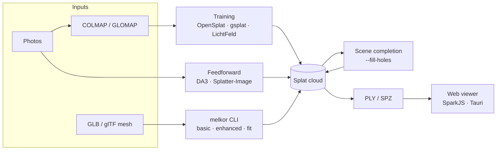

<div align="center">

# Melkor

**A cross-platform 3D Gaussian Splatting toolkit — conversion, training pipelines, scene completion, and a web viewer.**

[](https://github.com/sepahead/melkor/actions/workflows/ci.yml)
[](https://github.com/sepahead/melkor/releases)
[](LICENSE)


[Quick Start](#quick-start) ·
[Features](#features) ·
[Usage](#usage) ·
[Architecture](#architecture) ·
[Documentation](#documentation) ·
[Contributing](#contributing)

</div>

---

Melkor turns meshes and photo sets into 3D Gaussian splat scenes and gives you the tools to refine, compress, complete, and view them. A single CLI covers GLB/PLY/SPZ conversion with four quality tiers, densification-based scene completion, and GPU acceleration on Metal (macOS) and CUDA (Linux) with a bit-consistent CPU fallback. Around the core sit curated training pipelines (OpenSplat, gsplat, LichtFeld-Studio), feedforward reconstruction (Depth Anything 3), and a SparkJS web viewer with a Tauri desktop shell.

## Features

**Core CLI**
- **Four conversion modes** — Basic (fast vertex-to-splat), Enhanced (k-NN adaptive scale + surface alignment), Fit (differentiable-rendering optimization on Metal), Feedforward (pretrained networks)
- **Format support** — GLB/glTF → PLY/SPZ, PLY ↔ SPZ (SPZ compresses ~90% vs PLY, including spherical-harmonics data)
- **Scene completion** — densification-based hole filling, the 3DGS counterpart of inpainting: bridges occlusion voids and densifies sparse regions deterministically, with no learned prior ([docs/SCENE_COMPLETION.md](docs/SCENE_COMPLETION.md))

**Acceleration**
- **Unified compute backends** — one `ComputeProvider` interface dispatches to Metal, CUDA, or CPU at runtime; all three implementations are kept operation-for-operation consistent and are locked together by parity tests
- **Grid-accelerated k-NN** — uniform-grid neighbor search kernels (Metal + CUDA, with an identical CPU reference) keep enhanced conversion and scene completion on the GPU for clouds of any size

**Pipelines & viewing**
- **Training** — OpenSplat (multi-GPU), gsplat (CUDA DDP), gsplat-mps (Apple Silicon), LichtFeld-Studio (Linux)
- **Feedforward** — DA3 / Depth Anything 3, plus the strongest 2025–2026 SOTA models: MapAnything, VGGT, Pi3, AMB3R (geometry → COLMAP export → training) and YoNoSplat, SPFSplatV2 (direct splats), MoGe-2 (single-image); one installer with per-model license gating ([docs/FEEDFORWARD_SOTA.md](docs/FEEDFORWARD_SOTA.md))
- **Structure-from-Motion** — COLMAP and GLOMAP (10–100× faster mapping)
- **Web viewer** — SparkJS + THREE.js viewer for SPZ/SOG/SPLAT/PLY scenes with camera feeds, auto-orbit, fly controls, and **progressive streaming** (renders splats as they download); ships with a Playwright render-test suite and an optional Tauri desktop build ([viewer/README.md](viewer/README.md))
- **Streaming** — progressive/LOD viewer loading, streamable formats (SPZ, SOG, `.RAD`), and an installable online/streaming **3DGS reconstruction** stage (`setup_streaming.sh`: Gaussian-SLAM, SplaTAM, Splat-SLAM, 3DGStream → PLY → melkor); see [docs/STREAMING.md](docs/STREAMING.md)

## Quick Start

```bash
# Fetch pinned third-party deps and build (Metal is enabled automatically on macOS)
./scripts/setup_deps.sh
cmake -B build -DCMAKE_BUILD_TYPE=Release
cmake --build build -j

# Verify the toolchain and see which GPU backend is active
./build/melkor --info

# Convert a mesh to splats
./build/melkor input.glb output.ply
```

**Training from photos** (full pipeline: SfM → training → output):

```bash
./scripts/setup_all.sh
./scripts/train_from_images.sh ~/Photos/my_scene ~/output/my_scene
```

**Feedforward reconstruction** (no COLMAP, seconds):

```bash
./scripts/setup_da3.sh
./da3-infer --input images/ --output scene.ply
```

See [docs/QUICKSTART.md](docs/QUICKSTART.md) for the complete walkthrough.

## Usage

### Format conversion

```bash
./build/melkor model.glb output.ply                            # Basic (default)
./build/melkor model.glb output.ply --enhanced                 # Adaptive scale + surface alignment
./build/melkor model.glb output.ply --fit --iterations 5000    # Differentiable-rendering fit (Metal)
./build/melkor scene.ply scene.spz                             # Compress to SPZ
./build/melkor scene.spz scene.ply                             # Decompress back to PLY
```

### Scene completion (hole filling / densification)

```bash
# Fill occlusion holes and densify sparse regions of a trained scene
./build/melkor scene.spz completed.spz --fill-holes

# Denser fill, larger bridgeable holes
./build/melkor scene.ply completed.ply --fill-holes --fill-strength 0.8 --max-hole-size 12
```

Interior holes are bridged by an advancing front; the scene's outer boundary is never extended. Details, parameters, and the algorithm are documented in [docs/SCENE_COMPLETION.md](docs/SCENE_COMPLETION.md).

### Training

```bash
./scripts/train_from_images.sh /path/to/photos /path/to/output
./scripts/opensplat_wrapper.sh /path/to/colmap/project --gpu-ids 0,1,2,3 -o output.ply
./da3-infer --input images/ --output scene.ply
```

### Viewing

```bash
cd viewer
./fetch-assets.sh          # one-time: viewer libs + sample scenes
bun run serve              # http://127.0.0.1:8771
bun run test               # headless render tests
```

## Architecture



The core library (`melkor_core`) is platform-independent; GPU work goes through the `ComputeProvider` interface, backed per platform by `melkor_metal`, `melkor_cuda`, or a CPU stub. Neighbor searches share a single host-built uniform grid, so the Metal, CUDA, and CPU paths walk identical cells and differ only by float rounding.

## GPU Backends

| Platform | Backend | Enable | Notes |
|----------|---------|--------|-------|
| macOS (Apple Silicon) | Metal | default | compute kernels + differentiable rasterizer (`--fit`) |
| Linux (NVIDIA) | CUDA | `-DMELKOR_USE_CUDA=ON` | SM 60–90; grid k-NN and cloud processing on-device |
| Any | CPU | automatic fallback | bit-consistent reference implementation |

`melkor --info` prints the active backend and device. `--no-gpu` forces the CPU path.

## Documentation

| Document | Contents |
|----------|----------|
| [docs/QUICKSTART.md](docs/QUICKSTART.md) | End-to-end setup and first conversion/training run |
| [docs/PIPELINE.md](docs/PIPELINE.md) | The `pipeline.sh` photos-to-splats orchestrator |
| [docs/SCENE_COMPLETION.md](docs/SCENE_COMPLETION.md) | Hole filling / densification: algorithm, parameters, limits |
| [docs/OPENSPLAT_WRAPPER.md](docs/OPENSPLAT_WRAPPER.md) | Multi-GPU OpenSplat training wrapper |
| [docs/GLOMAP_WRAPPER.md](docs/GLOMAP_WRAPPER.md) | GLOMAP structure-from-motion wrapper |
| [docs/GSPLAT_CUDA.md](docs/GSPLAT_CUDA.md) | gsplat with CUDA and distributed training |
| [docs/LICHTFELD_WRAPPER.md](docs/LICHTFELD_WRAPPER.md) | LichtFeld-Studio training wrapper |
| [docs/DA3_FEEDFORWARD.md](docs/DA3_FEEDFORWARD.md) | Depth Anything 3 feedforward reconstruction |
| [docs/FEEDFORWARD_SOTA.md](docs/FEEDFORWARD_SOTA.md) | SOTA 2025–2026 feedforward models (MapAnything, VGGT, YoNoSplat, …) |
| [docs/STREAMING.md](docs/STREAMING.md) | Streaming splats: progressive/LOD viewer loading, SOG format, SLAM |
| [viewer/README.md](viewer/README.md) | SparkJS web viewer, Tauri shell, render tests |

## Testing

```bash
cd build && ctest --output-on-failure
```

Seven suites cover the core: format round-trip fuzzing (PLY, SPZ quaternions against the canonical spz decoder), compute-provider backend parity, scene-completion behavior (hole closure, boundary containment, CPU/GPU parity), differentiable-renderer gradient checks against finite differences, and the DA3 extraction path. CI builds macOS (Metal), macOS with AddressSanitizer, and Linux (CPU) on every push; the viewer has its own Playwright suite (`cd viewer && bun run test`).

When touching backend code, verify both configurations locally:

```bash
cmake -B build && cmake --build build -j && (cd build && ctest)            # Metal/CUDA
cmake -B build-cpu -DMELKOR_USE_METAL=OFF && cmake --build build-cpu -j \
  && (cd build-cpu && ctest)                                               # CPU/stub topology
```

## Project Structure

```
melkor/
├── include/melkor/    Public C++ headers (ComputeProvider, Densifier, converters, IO)
├── src/               Core library + CLI
│   ├── metal/         Metal backend (Objective-C++ hosts + .metal kernels)
│   └── cuda/          CUDA backend (host wrappers + .cu kernels)
├── tests/             Self-contained C++ test suites + Python tests
├── viewer/            SparkJS web viewer, Tauri shell, Playwright tests
├── scripts/           Setup, SfM, and training pipeline scripts
├── docs/              Per-component documentation
├── tools/da3/         DA3 feedforward inference
├── DA3coreml/         Depth Anything 3 CoreML port (ByteDance)
├── ml-sharp/          Apple ML research (vendored)
└── third_party/       Pinned vendored dependencies (tinygltf, stb, spz)
```

## Contributing

Contributions are welcome — see [CONTRIBUTING.md](CONTRIBUTING.md) for the development setup, backend-parity rules, and the pull-request checklist. Security issues should follow [SECURITY.md](SECURITY.md).

## License

MIT for the core Melkor code — see [LICENSE](LICENSE). Bundled third-party components keep their own licenses (Apache-2.0, AGPL-3.0, Apple Sample Code, MIT); see [NOTICE](NOTICE) and [THIRD_PARTY_LICENSES.md](THIRD_PARTY_LICENSES.md).

## Acknowledgments

- [3D Gaussian Splatting](https://github.com/graphdeco-inria/gaussian-splatting) — the original technique and reference implementation
- [OpenSplat](https://github.com/pierotofy/OpenSplat), [gsplat](https://github.com/nerfstudio-project/gsplat), [LichtFeld-Studio](https://github.com/MrNeRF/LichtFeld-Studio) — training backends
- [SPZ](https://scaniverse.com/news/spz-gaussian-splat-open-source-file-format) — compressed splat container by Niantic Scaniverse
- [Depth Anything 3](https://github.com/ByteDance-Seed/Depth-Anything-3) ([paper](https://arxiv.org/abs/2511.10647)) and [ml-sharp](https://github.com/apple/ml-sharp) — feedforward reconstruction
- [COLMAP](https://colmap.github.io/) and [GLOMAP](https://github.com/colmap/glomap) — structure-from-motion
- [Spark](https://sparkjs.dev/) — WebGL Gaussian-splat renderer used by the viewer
