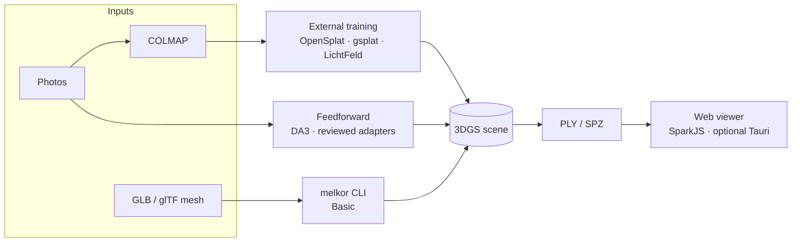
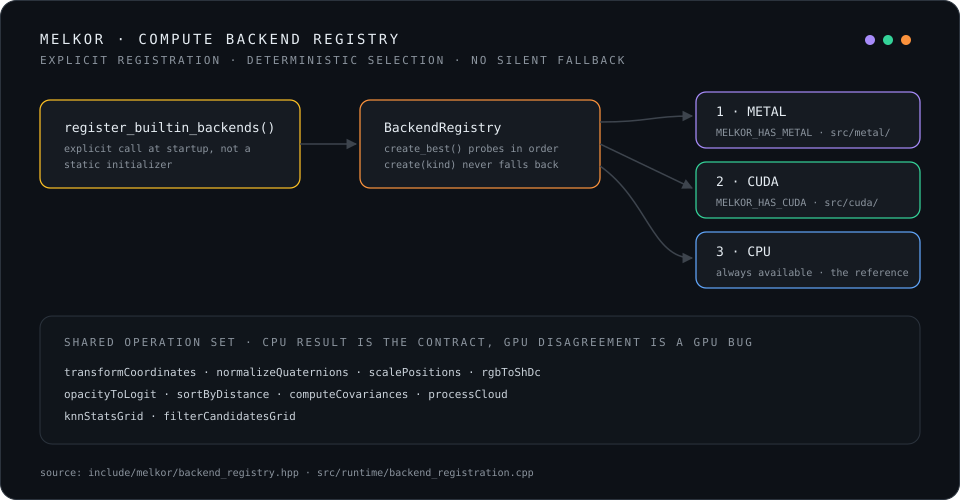
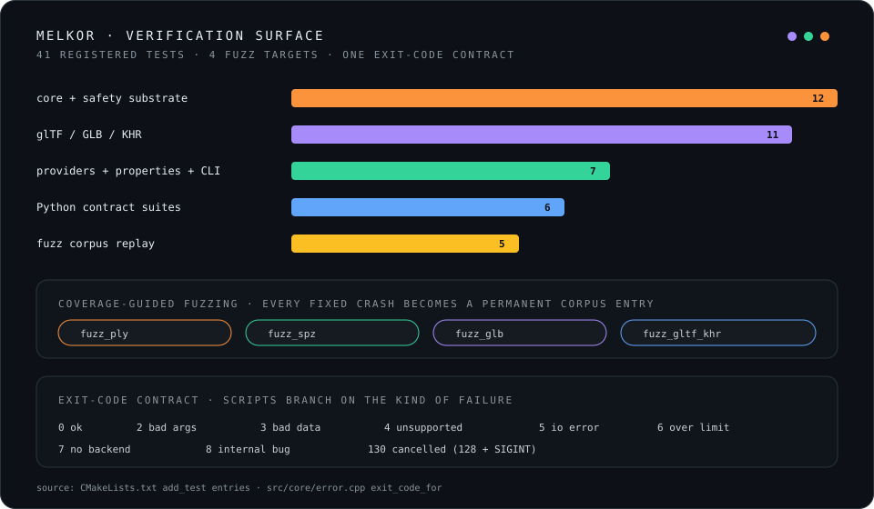

<div align="center">

<picture>
  <source media="(prefers-color-scheme: dark)" srcset="assets/logo-dark.svg">
  
</picture>

# Melkor

**A 3D Gaussian Splatting toolkit for conversion, inspection, scene completion, reconstruction pipelines, and viewing.**

[](https://github.com/sepahead/melkor/actions/workflows/ci.yml)
[](https://github.com/sepahead/melkor/tree/v2.0.0-rc.1)
[](LICENSE)


[Overview](#overview) ·
[Requirements](#requirements) ·
[Quick Start](#quick-start) ·
[Usage](#usage) ·
[Viewer](#viewer) ·
[Documentation](#documentation) ·
[Contributing](#contributing)

</div>

> **Development status: v2 hardening in progress. No production binary release is
> currently supported.**
>
> `main` is development software and its public contract is still changing.
> The `1.x` releases remain downloadable but are not the supported production line.
> `v2.0.0-rc.1` is a source-only candidate.
> It has no published signed binaries, SDK packages, Python wheels, or desktop applications.
>
> The first supported production line will be `v2.0.0`. What it must satisfy before it can
> be called that is tracked in [production blockers](docs/audit/production-blockers.md),
> and the product boundary is in [ROADMAP.md](ROADMAP.md). Support status:
> [SUPPORT.md](SUPPORT.md).

## Overview

Melkor combines a deterministic native CLI with external integration guides
and an offline-capable web viewer. The CLI converts GLB/glTF meshes and 3DGS
assets. It validates files without initializing a GPU. External programs
handle photo training and neural reconstruction.

### Support at a glance

| Capability | Status | Interface |
|---|---|---|
| Mesh → splats | Maintained vertex path | `melkor INPUT.glb OUTPUT.ply --basic` |
| 3DGS PLY ↔ SPZ | Maintained native path | Reads SPZ v1–v3. Writes SPZ v3. |
| Asset validation | Maintained native path | `melkor inspect INPUT [--json] [--strict]` |
| Scene completion | Internal development code | `--fill-holes` fails until the canonical model migration is complete. |
| Training from photos | Development wrapper | User-supplied COLMAP and OpenSplat executables |
| Feedforward reconstruction | Reviewed bridge/catalog | DA3 bridge. Other adapters are license- and platform-dependent. |
| Web viewing | Maintained viewer | PLY, SPZ, SPLAT, KSPLAT, and SOG/ZIP. The local file limit is 2 GiB. Browser and device memory can set a lower practical limit. |
| Desktop viewing | Developer build | Optional Tauri shell. Local bundles are unsigned. |

### Highlights

- **Honest conversion mode.** Basic maps mesh vertices to splats. Enhanced
  conversion is unavailable until the area-weighted sampler is complete.
- **Deterministic inspection.** `melkor inspect` reports metadata, counts,
  bounds, field provenance, and numeric hazards without changing the source or
  initializing a GPU. The JSON schema is versioned as `melkor.inspect.v1`.
- **Explicit format behavior.** Melkor currently reads SPZ v1–v3 and writes v3. Upstream
  SPZ has since moved to file-format v4. SPZ v4 support is a `v2.0.0` release blocker
  ([P0-09](docs/audit/production-blockers.md)). Melkor will claim support after tests
  against the pinned upstream implementation pass. SPZ is a quantized, compressed
  representation, so a conversion into it is lossy by construction. Melkor does not
  currently publish a measured compression ratio. Any such figure will be stated only
  with the dataset, version, and configuration that produced it.
- **Gated scene completion.** The advancing-front implementation remains an
  internal test target. The CLI fails closed until it uses canonical data.
- **Backend parity.** Metal, CUDA, and CPU share the same `ComputeProvider`
  contract and host-built uniform grid. Runtime parity uses numeric tolerances
  appropriate for normal floating-point rounding.
- **Focused viewer.** SparkJS + THREE.js provide private local-file opening,
  drag-and-drop, named camera views, deep-linked bundled scenes, progressive
  first-load rendering, orbit/fly controls, and a bounded-memory 4D player.

The OpenSplat and LichtFeld-Studio wrappers run one user-supplied executable.
They do not install or pin an external tool. The gsplat guide describes the
external boundary. It does not provide an install command.

The feedforward catalog includes a review date and license information. Some
checkpoints have non-commercial or unspecified terms. See
[the feedforward integration catalog](docs/FEEDFORWARD_SOTA.md).

Spark exposes `.RAD`/LOD primitives that Melkor can build on, but `.RAD` local
opening and LOD authoring are not current Melkor features.
`setup_streaming.sh list` prints a read-only research catalog.
It does not clone or install an external tool.
See [Streaming and 4D](docs/STREAMING.md).

## Requirements

- **Native CLI:** Git, CMake 3.24+, and a C++17 compiler.
- **macOS:** macOS 13+ with Xcode Command Line Tools. Metal is enabled by
  default.
- **Linux:** GCC or Clang for the CPU build. NVIDIA CUDA is optional, disabled
  by default, and requires CUDA Toolkit 11+.
- **Complete test suite:** Python 3.11 and NumPy 2.4.6 reproduce the pinned CI
  environment. Neither is required just to build or run the native CLI.
- **Viewer:** curl fetches digest-checked assets, Node.js generates project
  demos, and Bun runs the local server. Playwright/Chromium are needed only for
  render tests.
- **Reconstruction pipelines:** Python, CUDA, model, and license requirements
  vary by upstream tool. Follow the linked pipeline document before setup.

`scripts/setup_deps.sh` verifies the pinned third-party snapshots already
committed to this repository. It does not install system packages or download
live dependencies.

The Melkor core is MIT-licensed, and as of 2026-07-14 it no longer vendors any copyleft or
research-only source. What it redistributes — SPZ, tinygltf, stb — is permissively licensed
and pinned in `third_party/manifest.lock.json`.

External reconstruction and training systems remain under **their own terms**, which are not
Melkor's terms. OpenSplat is AGPL-3.0-only, and several model checkpoints are research-only,
non-commercial, or publish no clear terms at all. Melkor invokes those programs. It does not
ship them, and it cannot grant you rights to them. Review
[Third-party licenses](THIRD_PARTY_LICENSES.md) and [External adapters](docs/adapters/index.md)
before redistribution or model use.

## Quick Start

```bash
git clone https://github.com/sepahead/melkor.git
cd melkor

# Reproduce the lightweight Python environment used by the complete test suite.
# Skip this environment and the CTest step if you only need the native CLI.
python3.11 -m venv .venv
. .venv/bin/activate
python -m pip install --disable-pip-version-check \
  --only-binary=:all: numpy==2.4.6

# Verify vendored sources, configure, build, and test.
./scripts/setup_deps.sh
cmake -S . -B build -DCMAKE_BUILD_TYPE=Release \
  -DPython3_EXECUTABLE="$VIRTUAL_ENV/bin/python"
cmake --build build --parallel
ctest --test-dir build --output-on-failure --no-tests=error

# Confirm the source version and active compute backend.
./build/melkor --version
./build/melkor --info

# Convert and validate a mesh-derived splat scene.
./build/melkor input.glb output.ply
./build/melkor inspect output.ply --json --strict
```

Optional local installation:

```bash
cmake --install build --prefix "$HOME/.local"
"$HOME/.local/bin/melkor" --version
```

See [Quick Start](docs/QUICKSTART.md) for the complete conversion and
reconstruction walkthrough.

## Usage

### Convert formats

```bash
./build/melkor model.glb scene.ply                 # Basic mesh conversion
./build/melkor model.gltf scene.spz --basic        # Explicit basic mode
./build/melkor scene.ply scene.spz                 # 3DGS PLY → SPZ v3
./build/melkor scene.spz scene.ply                 # SPZ v1-v3 → 3DGS PLY
```

Basic conversion uses existing mesh vertices. It does not train a scene from
photographs. The retired `--fit` and `--feedforward` options fail closed.

### Inspect or inventory an asset

```bash
./build/melkor inspect scene.ply
./build/melkor inspect scene.spz --json --strict
./build/melkor inspect model.glb --json
```

Exit `0` means no errors, exit `1` means invalid data (or warnings under
`--strict`), and exit `2` means invalid command usage. See
[Asset inspection](docs/INSPECT.md) for the deterministic JSON contract and
format limits.

### Scene completion status

`--fill-holes` currently returns an error.
The internal densifier still uses the retired mutable data model.
See [Scene completion](docs/SCENE_COMPLETION.md) for the migration status.

### Train or reconstruct from photos

The development pipeline runs COLMAP and one user-supplied OpenSplat binary:

```bash
./scripts/pipeline.sh ~/Photos/my_scene ~/output/my_scene \
  --opensplat /reviewed/bin/opensplat
```

Run the OpenSplat wrapper on one selected CUDA device:

```bash
./scripts/opensplat_wrapper.sh /path/to/colmap/project \
  --opensplat /reviewed/bin/opensplat \
  --gpu 0 \
  --output output.ply
```

The wrapper rejects the former simulated multi-GPU modes.
Use the native command from a pinned external trainer for distributed work.
See [the gsplat status guide](docs/GSPLAT_CUDA.md).

DA3 provides a separate Linux/NVIDIA feedforward path. Review its checkpoint
terms before setup:

```bash
./scripts/setup_da3.sh --accept-unlocked-dependencies
./da3-infer --input images/ --output scene.ply
```

## Viewer

For a local viewer, fetch only digest-checked runtime libraries and
project-owned generated demos:

```bash
# Requires Node.js and Bun.
cd viewer
./fetch-assets.sh --runtime-only
bun run serve
# http://127.0.0.1:8771/
```

Use **Open local splat** or drop a PLY/SPZ/SPLAT/KSPLAT/SOG/ZIP file onto the
viewer. Local bytes remain in the browser/webview. Bundled scenes synchronize
to `?scene=<id>` for shareable links. Opening a local file removes that query
parameter so a private filename does not enter the URL.

The full render-test setup adds tens of MiB of ignored external developer
fixtures, optional generated conversions, and a local Chromium installation:

```bash
cd viewer
npm ci --ignore-scripts
npx playwright install chromium
./fetch-assets.sh
bun run test -- --project=chromium
```

See the [Viewer guide](viewer/README.md) for controls, asset provenance, the 4D
player, and Tauri developer builds.

## Architecture

Every conversion reads into one validated canonical model and writes from it:


The full reconstruction ecosystem around the CLI:


```mermaid
flowchart LR
    subgraph Inputs
        P[Photos] --> SfM[COLMAP]
        M[GLB / glTF mesh]
    end
    SfM --> T[External training<br/>OpenSplat · gsplat · LichtFeld]
    P --> FF[Feedforward<br/>DA3 · reviewed adapters]
    M --> C[melkor CLI<br/>Basic]
    T --> S[(3DGS scene)]
    FF --> S
    C --> S
    S --> F[PLY / SPZ]
    F --> V[Web viewer<br/>SparkJS · optional Tauri]
```

The platform-independent `melkor_core` library owns conversion, validation,
and completion. GPU work goes through `ComputeProvider`, backed by
`melkor_metal`, `melkor_cuda`, or the CPU reference. Neighbor searches share a
single host-built uniform grid, so each backend walks the same cells and may
differ only within documented floating-point tolerances.

## Compute Backends



| Platform | Backend | Enable | Qualification |
|---|---|---|---|
| macOS 13+ (Apple Silicon) | Metal | Default on macOS | Runtime parity-tested in hosted CI |
| Linux + NVIDIA | CUDA | `-DMELKOR_USE_CUDA=ON` | Maintained compile path. Hosted CI compiles it. Representative hardware runtime qualification is pending. |
| Any supported host | CPU | Automatic fallback, or `--no-gpu` | Reference implementation. It has parity tests where hardware permits, with normal float-rounding differences. |

`melkor --info` reports the active backend and device. Linux defaults to CPU
even when a CUDA Toolkit is installed. CUDA must be enabled explicitly.

Useful build topologies:

The CTest commands below assume the Quick Start test environment is active so
CMake can register the complete Python-backed suite.

```bash
# Strict default build: Metal on macOS, CPU on Linux.
cmake -S . -B build-strict -DMELKOR_WERROR=ON
cmake --build build-strict --parallel
ctest --test-dir build-strict --output-on-failure --no-tests=error

# Explicit CPU topology.
cmake -S . -B build-cpu \
  -DMELKOR_USE_METAL=OFF -DMELKOR_USE_CUDA=OFF
cmake --build build-cpu --parallel
ctest --test-dir build-cpu --output-on-failure --no-tests=error

# Linux/NVIDIA CUDA topology.
cmake -S . -B build-cuda -DMELKOR_USE_CUDA=ON
cmake --build build-cuda --parallel
./build-cuda/melkor --info  # must report Backend: CUDA
```

## Testing and Release Evidence



The native test suites cover:

- Hostile input and format round trips
- Deterministic inspection and scene-graph transforms
- Compute-provider parity and scene completion
- Strict CLI parsing and the DA3 extraction path

Hosted gates include:

- Warning-as-error native builds
- ASan and UBSan checks
- CPU and Metal runtime suites
- A CUDA compile check
- Swift, Python, and shell tests
- Playwright and SwiftShader rendering
- Rust and Tauri policy checks
- Dependency review and full-history secret scanning
- Deterministic release evidence

Hosted CUDA is compile-only. It is not a runtime hardware qualification.

The exact release procedure, evidence limitations, signing requirements, and
remaining production gates are documented in [Release and trust](docs/RELEASE.md).

## Repository Footprint

The main source tree intentionally tracks no GLB, glTF, PLY, SPZ, SPLAT,
KSPLAT, SOG, or ZIP scene fixtures. Workflows get large scenes, downloaded
models, viewer developer fixtures, builds, and training environments when
necessary. The README logo is a small, self-contained local SVG. It comes from
the canonical Melkor mark on the
[sepahead profile](https://github.com/sepahead/). It is not hotlinked and does
not make a cross-repository asset request.

This keeps fresh clones and ordinary native builds independent of optional
large assets. `viewer/fetch-assets.sh --runtime-only` is the lightweight viewer
path. The full fetch is reserved for render-test fixtures.

## Documentation

| Document | Contents |
|---|---|
| [Quick Start](docs/QUICKSTART.md) | End-to-end setup and first conversion/training run |
| [Asset inspection](docs/INSPECT.md) | Validation, JSON automation contract, and limits |
| [Pipeline](docs/PIPELINE.md) | Photos-to-splats orchestration |
| [Scene completion](docs/SCENE_COMPLETION.md) | Densification algorithm, parameters, and limits |
| [OpenSplat wrapper](docs/OPENSPLAT_WRAPPER.md) | Single-process external trainer contract |
| [COLMAP global mapper](docs/GLOMAP_WRAPPER.md) | Transitional `global_mapper` wrapper |
| [gsplat CUDA](docs/GSPLAT_CUDA.md) | External integration status and evidence needs |
| [LichtFeld-Studio](docs/LICHTFELD_WRAPPER.md) | Pass-through development wrapper |
| [DA3 feedforward](docs/DA3_FEEDFORWARD.md) | Depth Anything 3 reconstruction bridge |
| [Feedforward catalog](docs/FEEDFORWARD_SOTA.md) | Dated, license-aware integration catalog |
| [Streaming and 4D](docs/STREAMING.md) | Current viewer behavior, read-only catalog, and roadmap |
| [Viewer guide](viewer/README.md) | Web viewer, Tauri shell, provenance, and render tests |
| [Release and trust](docs/RELEASE.md) | Reproducible source checks and production release gates |
| [Release evidence](release/README.md) | Deterministic RC evidence format and reproduction |
| [Changelog](CHANGELOG.md) | Release history and notable changes |
| [Third-party licenses](THIRD_PARTY_LICENSES.md) | License boundaries for bundled and optional components |

## Project Structure

```text
melkor/
├── include/melkor/    Public C++ interfaces
├── src/               Core library and CLI
│   ├── metal/         Metal backend
│   └── cuda/          CUDA backend
├── tests/             C++ and Python test suites
├── viewer/            SparkJS viewer, optional Tauri shell, Playwright tests
├── scripts/           Setup, SfM, training, and validation scripts
├── docs/              Component and workflow documentation
├── tools/             Repository tooling: version sync, notices, dependency lock
├── release/           Deterministic source-RC evidence
└── third_party/       Pinned tinygltf, stb, and SPZ sources, with a lock manifest
```

External reconstruction and training systems are **not** vendored here.
The planned adapter manifests are not complete.
External programs retain their own licenses.

The project removed three snapshots from the MIT core on 2026-07-14:

- The AGPL OpenSplat snapshot
- The Depth Anything 3 CoreML port
- The Apple `ml-sharp` snapshot

[External adapters](docs/adapters/index.md) explains their attribution and
the reason for removal. The tag `archive/pre-v2-research-bundle-20260714`
preserves the old tree.

## Contributing

Contributions are welcome. Read [CONTRIBUTING.md](CONTRIBUTING.md) for the
development setup, backend-parity rules, and pull-request checklist. Report
security issues through [SECURITY.md](SECURITY.md).

## License

The core Melkor code is MIT-licensed. See [LICENSE](LICENSE). Bundled and
optional third-party components retain their own licenses and model terms. See
[NOTICE](NOTICE) and [THIRD_PARTY_LICENSES.md](THIRD_PARTY_LICENSES.md) before
redistributing the repository or using optional model weights.

## Acknowledgments

- [3D Gaussian Splatting](https://github.com/graphdeco-inria/gaussian-splatting)
  — the original technique and reference implementation
- [OpenSplat](https://github.com/pierotofy/OpenSplat),
  [gsplat](https://github.com/nerfstudio-project/gsplat), and
  [LichtFeld-Studio](https://github.com/MrNeRF/LichtFeld-Studio) — external
  training backends
- [SPZ](https://scaniverse.com/news/spz-gaussian-splat-open-source-file-format)
  — compressed splat container by Niantic Scaniverse
- [Depth Anything 3](https://github.com/ByteDance-Seed/Depth-Anything-3)
  ([paper](https://arxiv.org/abs/2511.10647)) — feedforward reconstruction
- [COLMAP](https://colmap.github.io/) and
  [GLOMAP](https://github.com/colmap/glomap) — structure-from-motion
- [Spark](https://sparkjs.dev/) — WebGL Gaussian-splat renderer used by the
  viewer

Maintained by [Sepehr Mahmoudian](https://github.com/sepahead).
