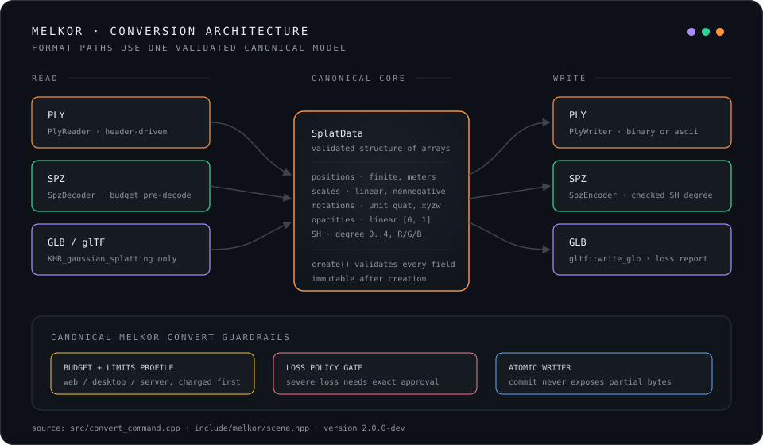

<div align="center">


# Melkor

**A bounded toolkit for Gaussian-splat inspection, conversion, and local viewing.**

[](https://github.com/sepahead/melkor/actions/workflows/ci.yml)
[](VERSION)
[](LICENSE)


[Scope](#scope) ·
[Formats](#format-contract) ·
[Build](#build-and-test) ·
[CLI](#cli) ·
[Viewer](#viewer) ·
[SDK](#c-sdk) ·
[Documentation](#documentation)

</div>

> **Development status:** Melkor `2.0.0-dev` has no supported production release.
>
> `main` can change its public contract.
> The `v2.0.0-rc.1` tag has no production support.
> The project publishes no signed binary, package, or desktop application.

## Scope

Melkor validates and converts Gaussian-splat assets.
Its native core has no renderer, GPU backend, trainer, learned model, or network loader.

The product has four clear surfaces:

| Surface | Contract |
|---|---|
| Native CLI | Inspect and convert supported PLY, SPZ, glTF, and GLB Gaussian assets. |
| C SDK | Inspect a PLY file through the stable C ABI. |
| Local viewer | Render local splat files through pinned SparkJS and three.js files. |
| Development adapters | Invoke user-supplied reconstruction programs outside the core. |

External adapters do not extend the native format contract.
They keep trainer code, model weights, and separate licenses outside the MIT core.

## Format contract

| Container | Read | Write | Profile |
|---|---|---|---|
| PLY | Yes | Binary or ASCII | Melkor canonical v1, Graphdeco 3DGS v1, or DA3 Gaussian v1 |
| SPZ | Versions 1 through 3 | Version 3 | `spz:spz-v1-v3` |
| glTF | Yes | No | Pinned `KHR_gaussian_splatting` release candidate |
| GLB | Yes | Yes | Pinned `KHR_gaussian_splatting` release candidate |

SPZ support is optional at build time and needs zlib.
SPZ version 4 is not supported.
The exact profile files are in [`profiles/`](profiles/).

PLY and SPZ do not store all source semantics.
Supply missing coordinate, unit, and color-space values from trusted producer information.
Melkor does not guess an ambiguous value.

The viewer has a separate rendering contract.
It also opens SPLAT, KSPLAT, and SOG/ZIP files through SparkJS.
That support does not add these formats to the native CLI.

## Design rules

Melkor applies these rules to every native conversion:

- Validate container structure before semantic decoding.
- Resolve one explicit format profile.
- Convert values into one canonical `SplatData` model.
- Reject non-finite data and broken model invariants.
- Apply one shared resource budget and operation context.
- Check cancellation during long operations.
- Record each representational loss in a JSON report.
- Require the exact code for each severe loss approval.
- Write through a same-directory atomic temporary file.
- Preserve an existing destination after each failure before output installation.
- Report a full-durability failure that occurs after output installation.

The canonical model uses meters, normalized XYZW quaternions, linear scales, linear opacity, and real spherical harmonics.
See [Canonical semantics](docs/reference/canonical-semantics.md) for the complete contract.



## Requirements

Install these tools for a native developer build:

- Git
- CMake 3.24 or later for the included presets
- Ninja
- A C++17 compiler
- zlib for SPZ support

Python 3.11 adds the complete repository test set.
Install `jsonschema==4.26.0` and `numpy==2.4.6` for those tests.
The CLI does not need Python at run time.

The native development build targets macOS 13 or later.
Hosted CI uses macOS 15, Ubuntu 24.04, and Windows Server 2025.
Its compiler checks use AppleClang, Clang, GCC, and MSVC.

## Build and test

```bash
git clone https://github.com/sepahead/melkor.git
cd melkor

python3.11 -m venv .venv
. .venv/bin/activate
python -m pip install --disable-pip-version-check \
  --only-binary=:all: jsonschema==4.26.0 numpy==2.4.6

./scripts/setup_deps.sh
cmake --preset dev -DPython3_EXECUTABLE="$VIRTUAL_ENV/bin/python"
cmake --build --preset dev --parallel
ctest --preset dev
```

`scripts/setup_deps.sh` verifies committed dependency snapshots.
It does not download a live dependency.

Build without SPZ when zlib is unavailable:

```bash
cmake --preset spz-off
cmake --build --preset spz-off --parallel
ctest --preset spz-off
```

## CLI

The CLI has two commands:

```text
melkor inspect INPUT [options]
melkor convert INPUT OUTPUT [options]
```

See the [complete CLI reference](docs/CLI.md) for every option, profile, and automation rule.

Inspect a self-describing asset:

```bash
./build/dev/melkor inspect scene.glb --json --strict
./build/dev/melkor inspect scene.ply --limits-profile desktop
```

Inspect a Graphdeco PLY file only after you verify its missing semantics:

```bash
./build/dev/melkor inspect trained.ply \
  --input-profile ply:graphdeco-3dgs-v1 \
  --source-frame gltf-luf \
  --source-unit-to-meter 1 \
  --source-color-space lin_rec709_display
```

Convert a Gaussian asset:

```bash
./build/dev/melkor convert scene.glb scene.ply
./build/dev/melkor convert scene.ply roundtrip.glb
```

Each successful conversion writes one loss report to stdout.
Use the report only when the command returns exit status zero.
The command writes the report after output staging and before the atomic commit.
A severe loss blocks the output unless you approve its exact code:

```bash
./build/dev/melkor convert input.glb output.spz \
  --allow-loss LOSS_CODE
```

Review the reported feature and effect before you approve a code.
See [Loss policy](docs/reference/loss-policy.md) and [Resource limits](docs/reference/resource-limits.md).

Use `--input-format` or `--output-format` for a path without a recognized suffix.
Use `--` before a path that starts with a hyphen.

## C SDK

The installed SDK exposes only the stable C ABI and version constants.
C and C++ programs call the same ABI.
The current operation validates one PLY file and reports its splat metadata.

```bash
cmake --preset release
cmake --build --preset release --parallel
cmake --install build/release --prefix "$PWD/build/install"
./scripts/test_sdk_install.sh -DMELKOR_BUILD_SPZ=ON
```

A CMake consumer uses `find_package(Melkor CONFIG REQUIRED)` and links `Melkor::melkor`.
The project does not install its internal C++ headers.

## Viewer

The viewer keeps local file bytes in the browser or webview.
It does not upload them.
Its development server binds to the loopback interface.

```bash
cd viewer
./fetch-assets.sh --runtime-only
bun run serve
```

Open `http://127.0.0.1:8771/`.
Use **Open local splat** or drop a supported file onto the page.

Local files have a 256 MiB input limit and a 5,000,000-splat limit.
The viewer accepts binary PLY records with a header no larger than 64 KiB.
It accepts Graphdeco fields or basic point-cloud fields. It rejects Melkor canonical PLY fields.
SOG/ZIP files also have entry, directory, expanded-size, expansion-ratio, and decoded-image limits.
Browser and device memory can impose a lower limit.

The optional Tauri shell uses no command IPC permission.
Its current macOS minimum is 14.0 because SOG decoding needs Safari 17 WebKit APIs.
Developer bundles are unsigned.

See the [Viewer guide](viewer/README.md) for controls, temporal playback, provenance, and tests.

## External adapters

The scripts in [`scripts/`](scripts/) can invoke user-supplied reconstruction tools.
These scripts are development adapters.
They do not install a supported trainer or grant rights to external code and weights.

Review these documents before you use an adapter:

- [Pipeline guide](docs/PIPELINE.md)
- [Adapter boundary](docs/adapters/index.md)
- [Third-party licenses](THIRD_PARTY_LICENSES.md)

## Verification and release state

The native suite includes unit, property, CLI, install, feature, and fuzz-replay tests.
CI also checks sanitizers, Windows builds, the viewer, Rust policy, dependency changes, and release evidence.

No test count is a release guarantee.
The required release evidence and open production gates are authoritative:

- [Release and trust](docs/RELEASE.md)
- [Production blockers](docs/audit/production-blockers.md)
- [Support policy](SUPPORT.md)
- [Security policy](SECURITY.md)

The source tree tracks no large viewer scene fixture.
The viewer fetch script verifies each downloaded fixture digest.

## Documentation

| Document | Contents |
|---|---|
| [Documentation index](docs/README.md) | Guide map, document status, and audit-record boundary |
| [Quick Start](docs/QUICKSTART.md) | Build, inspect, convert, install, and viewer steps |
| [CLI reference](docs/CLI.md) | Commands, options, profiles, loss reports, and automation rules |
| [Asset inspection](docs/INSPECT.md) | Inspection report, diagnostics, and exit codes |
| [Canonical semantics](docs/reference/canonical-semantics.md) | Canonical values and format mappings |
| [Loss policy](docs/reference/loss-policy.md) | Loss severity and approval rules |
| [Resource limits](docs/reference/resource-limits.md) | Limit profiles and operation controls |
| [Threat model](docs/security/threat-model.md) | Trust boundaries, controls, and known gaps |
| [Viewer guide](viewer/README.md) | Local viewer and desktop developer build |
| [Release and trust](docs/RELEASE.md) | Evidence generation and release gates |
| [Migration guide](docs/migrations/v1-to-v2.md) | Removed v1 surfaces and v2 replacements |

## Project structure

```text
melkor/
├── include/melkor/    Private C++ headers and the public C ABI header
├── src/               Format, safety, CLI, and C ABI implementation
├── profiles/          Machine-readable format profiles
├── schemas/           Inspection, loss-report, and profile schemas
├── tests/             Native, CLI, install, and repository tests
├── fuzz/              Fuzz targets and reviewed seed corpora
├── viewer/            Local SparkJS viewer and optional Tauri shell
├── scripts/           Verification, release, and external adapter scripts
├── tools/             Repository policy tools
├── release/           Deterministic source evidence
└── third_party/       Pinned source snapshots and patch records
```

## Contributing

Read [CONTRIBUTING.md](CONTRIBUTING.md) before you change a public contract.
Report security issues through [private vulnerability reporting](SECURITY.md#report-a-vulnerability-privately).

## License

Melkor uses the MIT License.
Bundled and optional dependencies keep their own terms.
Read [NOTICE](NOTICE) and [THIRD_PARTY_LICENSES.md](THIRD_PARTY_LICENSES.md) before redistribution.

Maintained by [Sepehr Mahmoudian](https://github.com/sepahead).
