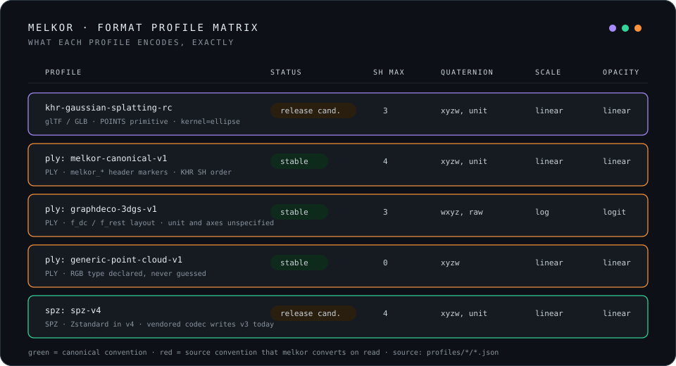

# Canonical semantics

Melkor uses one canonical Gaussian representation for all native format paths.
Format adapters convert storage conventions only at their boundaries.

The canonical value is a `SplatPrimitive`.
It contains validated `SplatData`, `SplatMetadata`, and `Provenance`.

## Canonical values

| Quantity | Storage | Canonical domain |
|---|---|---|
| Position | float32 | Finite meters in `gltf-luf` |
| Scale | float32 per axis | Finite, linear, and nonnegative |
| Rotation | float32 quaternion | Normalized XYZW |
| Opacity | float32 | Finite linear value in `[0, 1]` |
| SH | Contiguous float32 | Real Condon-Shortley basis, degree 0 through 4 |

`SplatData::create` validates all parallel lengths and numeric domains.
It stores normalized quaternions.
It exposes no mutable array reference.

Zero scale is a valid degenerate canonical Gaussian.
A target that cannot encode zero scale must report a loss or reject the conversion.

## Coordinate frames and units

The canonical frame identifier is `gltf-luf`.
Its basis-to-canonical matrix is the identity and its unit is one meter.

The frame registry also defines `ply-rdf` and `spz-rub`.
Each entry contains an exact orthogonal basis map and a unit scale.

PLY does not define a coordinate frame.
Melkor uses a trusted header marker or an explicit command option.
It does not infer a frame from a filename or common producer convention.

A frame conversion changes the mean, covariance, rotation, and directional SH data.
Changing only the position is invalid.

## Activation domains

The canonical scale is linear.
The canonical opacity is linear.

Graphdeco PLY stores log scale and logit opacity.
Its reader applies `exp` and sigmoid exactly once.
Its writer applies the inverse operations exactly once.

DA3 Gaussian PLY uses the same value domains and field order.
Its exact profile permits complete SH data through degree 4.

SPZ versions 1 through 3 store quantized values through the pinned codec contract.
The adapter converts them once into canonical values.

## Spherical harmonics

The canonical SH layout is splat-major.
Each splat stores `(degree + 1)²` RGB coefficient vectors.
The coefficient index precedes the RGB channel index.

The degree-0 coefficient follows this relation:

```text
rgb = SH_C0 * sh_dc + 0.5
```

This relation is not an sRGB transfer function.
Color-space conversion and SH conversion are separate operations.

The pinned glTF profile supports SH degree 0 through 3.
Canonical PLY supports degree 0 through 4.
SPZ versions 1 through 3 support degree 0 through 3.

A degree reduction reports `LOSS_SH_DEGREE_TRUNCATED`.
The loss is severe and needs exact approval.

## Affine transforms

A Gaussian covariance is:

```text
Sigma = R * diag(scale^2) * transpose(R)
```

For a node linear map `A`, Melkor computes:

```text
Sigma' = A * Sigma * transpose(A)
```

The decomposition returns a normalized rotation and nonnegative scales.
The glTF profile rejects reflection, singular maps, and material shear because their rendering semantics are undefined.

Melkor rotates degree 1 through 3 SH coefficients for a proper rotation.
It leaves degree 0 unchanged.

## Metadata

`SplatMetadata` records:

- The canonical coordinate frame and unit
- Quaternion, scale, and opacity domains
- Color space
- SH basis and degree
- Optional antialiasing state

An unknown antialiasing state is different from `false`.
A target override or metadata omission must enter the loss report.

## Format boundaries



| Profile | Read | Write | Important stored convention |
|---|---|---|---|
| `ply:melkor-canonical-v1` | Yes | Yes | Canonical values and required semantic markers |
| `ply:graphdeco-3dgs-v1` | Yes | Yes | WXYZ, log scale, logit opacity, Graphdeco SH order |
| `ply:da3-gaussian-v1` | Yes | Yes | Pinned DA3 field order and complete degree-4 SH data |
| `spz:spz-v1-v3` | Yes | Version 3 | Gzip container and quantized values |
| `khr-gaussian-splatting-rc-63770cc` | glTF and GLB | GLB | Pinned release-candidate extension, degree 0 through 3 |

The profile identifier defines meaning.
An existing identifier never changes meaning within the v2 line.

## Provenance

Provenance records the source format, source profile, optional source digest, and operations.
It has no source-path field.

Reproducible JSON emits null operation timestamps.
The format readers report verified source byte counts from completed reads.
