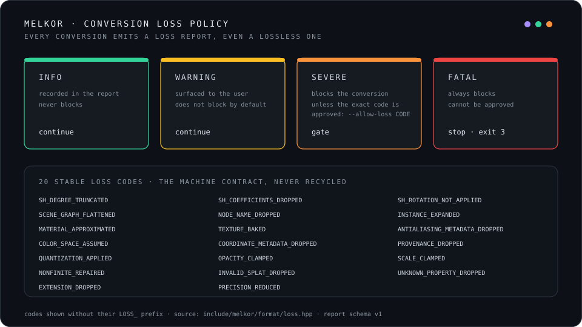

# Loss policy

A format conversion is honest only when it says what it lost. Converting a degree-4 SPZ asset to
the degree-3 glTF profile drops coefficients. Flattening a scene graph into a point cloud loses
hierarchy. Quantizing into SPZ introduces measurable error. These changes are not failures. A
successful conversion must still report them.

Every conversion therefore produces a **loss report** (`include/melkor/format/loss.hpp`,
serialized per `schemas/loss-report-v1.schema.json`), including a zero-loss report, so automation
never has to infer whether reporting was omitted.

## Severities and the policy

| Severity | Meaning | Behavior |
|---|---|---|
| `info` | Representational change, no expected rendered difference | Recorded, passes. |
| `warning` | Measurable but usually acceptable, e.g. quantization within a published bound | Recorded, passes. |
| `severe` | Semantic data removed or guessed, e.g. SH degree 4 → 3 | **Blocks the commit** unless the caller approves this exact loss code. |
| `fatal` | The target cannot represent the asset without violating an invariant | **Always blocks. Cannot be approved.** |

Approval is per **exact code**: `--allow-loss LOSS_SH_DEGREE_TRUNCATED`. The API takes exact
codes, not a blanket flag, so a program cannot wave through a loss it did not name. A CLI-only
`--allow-loss all` may exist for expert recovery, but it never covers a fatal or a safety
condition and is recorded prominently.

## Losses are not errors

A malformed file, violated invariant, resource-limit failure, or unsupported required extension
is an **error**, not a loss. The loss policy cannot approve it. The policy governs
*representational* trade-offs in a valid conversion, not failures.

## Stable codes

The loss codes (`LOSS_SH_DEGREE_TRUNCATED`, `LOSS_SCENE_GRAPH_FLATTENED`, `LOSS_QUANTIZATION_APPLIED`,
…) are stable machine identifiers. A consumer that special-cases one can rely on it meaning the
same thing across the 2.x line. The committed report also records which codes were approved, so a
reviewer can see which losses were deliberately accepted.
