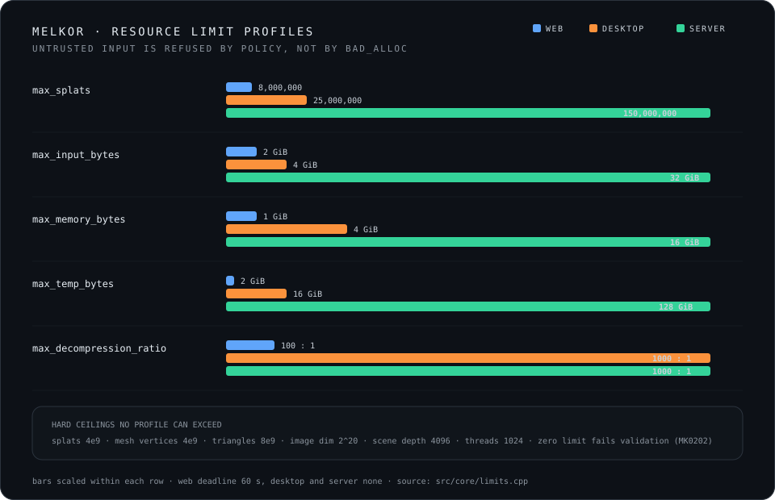

# Resource limits

Melkor treats a well-formed, very large file as untrusted input.
A valid file can still exhaust memory, disk space, or processing time.

Each native command creates one `Budget` and one `OperationContext`.
The readers, canonical model, loss planner, and writer share that context.

The context provides:

- Cumulative byte and object counters
- Owned working-memory and temporary-file charges
- Cooperative cancellation
- A monotonic deadline
- Optional structured progress events

## Named profiles

Select a profile with `--limits-profile web|desktop|server`.
The CLI default is `desktop`.

| Limit | web | desktop | server |
|---|---:|---:|---:|
| Primary input bytes | 2 GiB | 4 GiB | 32 GiB |
| External resource bytes | 512 MiB | 4 GiB | 64 GiB |
| Decoded bytes | 2 GiB | 8 GiB | 64 GiB |
| Working memory | 1 GiB | 4 GiB | 16 GiB |
| Temporary output | 2 GiB | 16 GiB | 128 GiB |
| Decompression ratio | 100:1 | 1000:1 | 1000:1 |
| Splats | 8 million | 25 million | 150 million |
| glTF nodes | 100,000 | 1 million | 5 million |
| Accessors and buffer views | 100,000 | 1 million | 5 million |
| External resources | 64 | 512 | 4,096 |
| PLY header bytes | 1 MiB | 4 MiB | 16 MiB |
| One metadata string | 256 KiB | 1 MiB | 4 MiB |
| All metadata | 4 MiB | 16 MiB | 64 MiB |
| Scene depth | 64 | 64 | 256 |
| Deadline | 60 seconds | None | None |

These values are safety defaults.
They are not statements about asset quality or typical hardware capacity.

## Accounting rules

Melkor charges the primary file before format decoding.
A `.gltf` file also charges each permitted adjacent resource.

The budget charges compressed SPZ input before the header probe.
The probe derives the packed decoded size and point count.
Melkor checks the decoded-byte cap and compression ratio before full inflation.

Working-memory charges use owned `Budget::Charge` values.
A charge remains active while the related allocation remains live.
Temporary-file charges remain active while `AtomicWriter` owns the temporary file.

Object limits use high-water observation.
A shared node or accessor does not consume its limit again only because code revisits it.

## Cancellation and deadlines

Long loops call `OperationContext::checkpoint` at bounded intervals.
The checkpoint checks cancellation, checks the deadline, and reports progress.

`SIGINT` requests cancellation in the CLI.
Cancellation exits with code `130`.
A deadline violation exits with code `6`.

The web profile has a 60-second deadline.
The desktop and server profiles have no default deadline.
Native API callers can set an explicit deadline.

## No unlimited profile

The CLI accepts only `web`, `desktop`, and `server`.
It does not accept `custom`.

Native callers can construct custom `Limits`.
Every budget-backed value must be greater than zero.
`Limits::validate` also enforces implementation ceilings and internal consistency.

Checked arithmetic, path containment, and output integrity remain active for every profile.

## Diagnostics

A limit failure uses `ErrorCode::resource_limit` and CLI exit code `6`.
The diagnostic names the resource, limit, current use, request, and operation.
It includes a larger named-profile hint when one exists.
